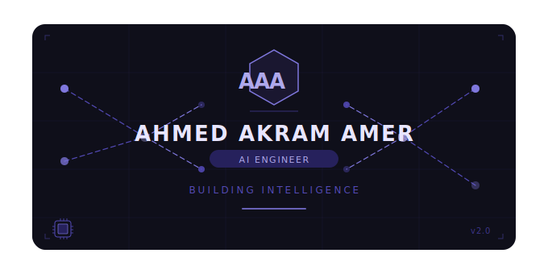

<!-- Premium Gradient Header -->

  

  

<h1 align="center">Ahmed Akram Amer</h1>
<h3 align="center">AI & Data Science Engineer • ML Systems • LLM Architect</h3>

  
  

---

## 🚀 Who Am I?

I build intelligent systems that turn data into real impact.  
From classical machine learning to Large Language Models and RAG pipelines — I focus on production-ready AI.

⚡ I enjoy transforming research ideas into scalable systems.  
🧠 Strong believer in end-to-end ML ownership.  
📈 I optimize models not just for accuracy — but for deployment efficiency.

---

## 💼 Experience Highlights

- 🔹 Built ML models reaching **90%+ accuracy**
- 🔹 Reduced inference time by **35%** via containerized deployment
- 🔹 Automated ML workflows reducing cycle time by **40%**
- 🔹 Delivered freelance ML systems with **real client impact**

---

## 🧠 AI & LLM Stack

---

## 🛠 Core Tech

---

## 🏅 Certifications

---

## 🎓 Education

🎓 Computer Science & Engineering  
Menoufia University  
GPA: **3.72 / 4.0**

---

## 📊 GitHub Analytics

  
  

---

---

## 🌐 Website

## 📫 Let's Connect

---

  

